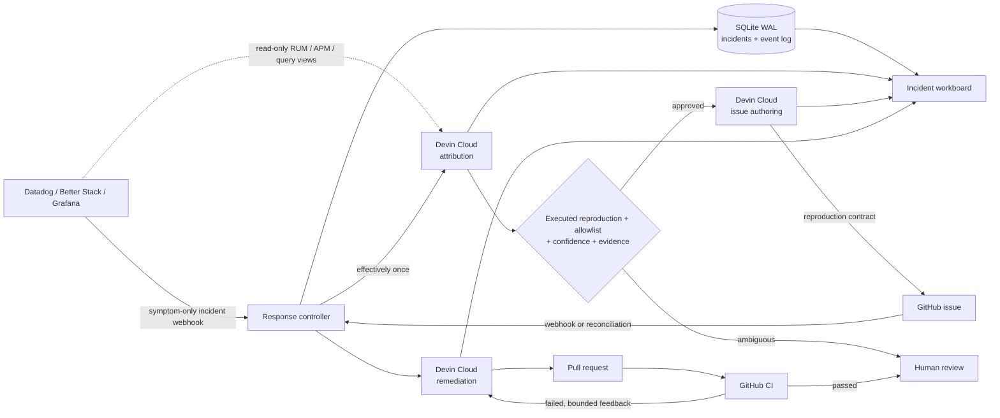

# Devin Superset Incident Autopilot

An event-driven response control plane for customer-facing Apache Superset
incidents. An observability platform qualifies the incident; this service gives
that incident one durable Devin workflow from investigation to a tested pull
request.

> Alerts are evidence. The incident is the unit of engineering work.

## What it does

- Multiple deliveries and lifecycle updates for one upstream incident converge
  on one workflow.
- An atomic dispatch lease and deterministic Devin tags prevent duplicate paid
  sessions.
- A read-only attribution Devin inspects the product and Superset repositories,
  then recommends the responsible component with evidence and confidence.
- The controller requires an executable reproduction, then validates repository
  allowlist, confidence, and evidence before an issue can be created.
- The managed issue triggers a separate remediation Devin that fixes, tests,
  and opens a PR.
- Failed GitHub checks resume that same Devin session and update the same PR;
  fingerprint deduplication and a two-attempt cap prevent retry storms.
- Recovery of customer impact does not erase the permanent remediation work.
- A workboard exposes source events, duplicate deliveries, sessions, artifacts,
  success state, and time to issue and PR.

The demo keeps human review as the merge and deployment gate.

## Architecture



The controller separates three identities:

1. `event_id`: one webhook delivery, used for transport idempotency.
2. `incident_id`: the upstream incident, used as the workflow identity.
3. `workflow run ID`: the local correlation key carried by Devin sessions,
   GitHub issues, and PRs.

The full state and trust model is in [docs/architecture.md](docs/architecture.md).

## Demo surfaces

- **Customer analytics:** mock SaaS product using
  `@superset-ui/embedded-sdk`.
- **Incident simulator:** sends a symptom-only monitor trigger plus a duplicate
  delivery. A deterministic observability snapshot stands in for the read-only
  RUM, APM, query, configuration, health, and change views that Devin would
  access through provider APIs in a customer environment.
- **Incident workboard:** tracks Incident → Attribution → Validated Issue → Pull
  Request → Resolved across concurrent workflows, including routing evidence,
  CI state, and feedback retries.

## Run the live workflow

This starts real Devin Cloud sessions and creates real GitHub artifacts. Docker
will not start the controller without Devin credentials. The Datadog alert and
its read-only telemetry export are simulated inputs; Devin work is live.

1. Create a Devin API service user with `ManageOrgSessions` and
   `ViewOrgSessions`. Connect the product repository and a **writable Superset
   fork** to the same Devin organization. The CD-1 scenario needs the unfixed
   Superset baseline: the submitted fork's `master` is at
   `4511c1381930ec53cd74c1e25c3ad4397768e2b4`; PR #12 contains the fix but
   is not merged. Use a writable copy of that baseline for your own run.
2. Clone this repository, copy `.env.example` to `.env`, and set
   `DEVIN_API_KEY`, `DEVIN_ORG_ID`, `GITHUB_REPOSITORY`, and
   `PRODUCT_REPOSITORY`. Set `GITHUB_TOKEN` when either repository is private;
   for public repositories it is optional but reduces GitHub polling from 120
   to 20 seconds. Devin's GitHub connection, rather than this token, must have
   write access to the Superset fork. `GITHUB_WEBHOOK_SECRET` is optional because
   polling also detects newly created managed issues.
3. Check the setup, build the reusable Devin environment, and start Docker:

```bash
git clone https://github.com/engineerA314/devin-demo.git
cd devin-demo
cp .env.example .env
# Edit .env with your Devin organization, API key, and repository names.
docker compose config --quiet
make doctor
make provision-devin-environment
docker compose up --build -d
```

Open <http://localhost:3000/incident-simulator> and select **Trigger CD-1
incident**. The simulator sends one monitor event and a duplicate delivery.
Watch the real sessions and ticket at
<http://localhost:3000/incident-resolution>; the validated issue and tested PR
appear in the configured Superset fork. Each run uses a new upstream incident ID
and can consume Devin credits. `make doctor` checks API reachability and the
repository baseline; it cannot verify Devin's GitHub write permission.

The separate customer SaaS page at <http://localhost:3000/customer-analytics>
embeds a real Superset dashboard only when the `SUPERSET_*` values are set.
See [Run the Superset fork](#run-the-superset-fork) for that optional local
display setup. It is not needed for the incident-to-PR workflow.

The webhook contains only customer impact: chart timeout rate, render latency,
and affected tenants. It does not name Superset, the cache path, or a target
repository. The fixture files under `apps/controller/fixtures/cd-1` are
provider-shaped exports rather than a second observability product. Attribution
Devin must correlate affected and healthy RUM events, APM traces, warehouse
fingerprints, chart configurations, service health, and deployment history
and execute a focused reproduction before the controller admits an
issue-creation session. `make provision-devin-environment` builds the reusable
Devin Cloud snapshot with Superset's Python development environment, pytest,
and the Embedded SDK dependencies.

## Incident event contract

`POST /api/v1/incidents/events`

```json
{
  "event_id": "datadog:event:01J...",
  "incident_id": "datadog:incident:4821",
  "event_action": "trigger",
  "source": "datadog",
  "title": "Embedded analytics authentication recovery degraded",
  "service": "superset-embedded",
  "occurred_at": "2026-09-20T04:03:43Z",
  "signals": [
    { "key": "error_rate", "label": "Error rate", "value": 18.7, "unit": "%" },
    { "key": "p95_latency_ms", "label": "p95 latency", "value": 4280, "unit": "ms" }
  ],
  "evidence": { "summary": "Customer dashboard loads remain degraded." },
  "metadata": { "environment": "production" }
}
```

`event_action` is one of `trigger`, `update`, `acknowledge`, or `resolve`.
Every unique event is retained in the incident timeline. Repeating an
`event_id` increments the duplicate-delivery counter without starting work
again. A new event with the same `incident_id` updates the existing workflow.

## Why three Devin roles

**Attribution Devin** treats the incident payload and linked observability
snapshot as untrusted evidence. It compares affected and healthy requests and
inspects both the embedded product and Superset, but cannot write to GitHub.

**Issue Devin** starts only after the controller validates an executed
reproduction, repository allowlist, confidence, and evidence. It independently
confirms the defect in the selected repository and creates one structured issue
without modifying code.

**Remediation Devin** is admitted by the `autopilot-managed` GitHub label. It
independently reproduces the issue, implements the smallest fix, adds a
regression test, runs focused checks, opens one linked PR, and stops before
merge.

The issue is therefore a reviewable contract between cross-system production
evidence and code modification.

## Verified incident run

The latest end-to-end run produced:

- Workflow `INC-6736371C`
- Superset ownership attributed with 82% confidence after an executed failing
  reproduction in 3m 41s
- [Superset issue #11](https://github.com/engineerA314/superset/issues/11) in
  6m 21s
- [Superset PR #12](https://github.com/engineerA314/superset/pull/12) in 14m 19s
- Verification recorded in 14m 40s; 640 related tests, Ruff, and Mypy pass
- The PR remains open for the explicit human review gate

The measured load reproduction and its controlled causal check are documented in
[CD-1 validation](docs/evidence/cd1-validation.md). That load harness was not
rerun against PR #12.

## Run the Superset fork

Clone the submitted Superset fork beside this repository, then run:

```bash
git clone https://github.com/engineerA314/superset.git ../superset
make superset
```

The script starts the fork, loads an example dashboard, enables embedded mode,
and configures local origins. To show the real embedded dashboard in Luma, set:

```dotenv
SUPERSET_INTERNAL_URL=http://host.docker.internal:9001
SUPERSET_PUBLIC_URL=http://localhost:9001
SUPERSET_DASHBOARD_ID=00000000-0000-4000-8000-000000000001
SUPERSET_USERNAME=admin
SUPERSET_PASSWORD=admin
```

Restart the app with `docker compose up --build -d` after changing `.env`.

## Validation

```bash
cd apps/web && npm install && npm run build
cd ../..
python -m venv .venv
.venv/bin/pip install -r apps/controller/requirements.txt
PYTHONPATH=apps/controller .venv/bin/python -m unittest discover -s apps/controller/tests -v
docker compose config --quiet
```

## Safety boundaries

- The repository is fixed server-side to the configured Superset fork.
- Incident payloads and GitHub bodies are treated as untrusted input.
- SQLite uses WAL mode and `BEGIN IMMEDIATE` for atomic dispatch claims.
- Devin sessions, issues, and PRs carry the same machine-readable run marker.
- Session ACU limits are configured separately for triage and remediation.
- Signed GitHub webhooks are verified when push intake is enabled.
- Devin never merges or deploys its own PR.
- `.env` and local state are excluded from Git.

## Repositories

- [engineerA314/devin-demo](https://github.com/engineerA314/devin-demo):
  controller, UI, Docker runtime, and Devin integration
- [engineerA314/superset](https://github.com/engineerA314/superset): Superset
  fork, selected issues, and remediation PRs
