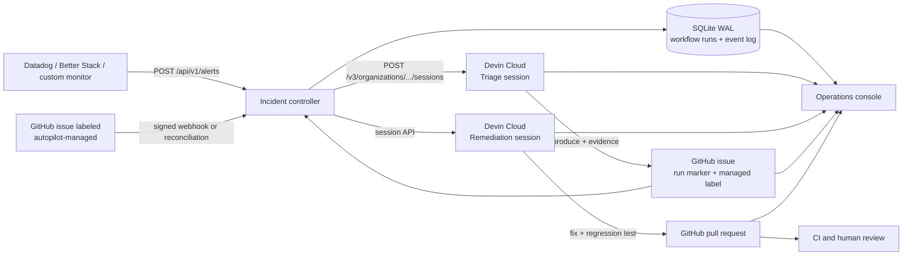

# Devin Superset Incident Autopilot

An event-driven incident response system for customer-facing analytics built
with Apache Superset Embedded SDK and Devin Cloud.

The demo starts with a production-style alert, asks one Devin to validate the
signal and write a reproducible GitHub issue, then lets a separate Devin fix the
issue, test the change, and open a pull request. An operations console shows
multiple independent runs, their autonomous sessions, engineering artifacts,
success signals, and elapsed time. A human remains the merge and deployment
gate.

## Why this workflow

Embedded analytics failures are customer-facing, but their source may span the
host SaaS application, the Superset SDK, authentication, and the Superset
backend. The expensive part of an alert is the engineering loop after the
page: gathering evidence, reproducing the behavior, identifying ownership,
building a safe fix, and proving it with tests.

This project turns that loop into durable cloud infrastructure. Devin runs in a
shared, prebuilt repository environment, works while the team is offline, and
handles several incidents concurrently. GitHub issues and pull requests remain
the reviewable system of record.

## Live proof

- Incident: `INC-C4C51257`, a SEV-2 spike to 18.7% guest-token errors across
  1,264 embedded sessions
- Triage output: [Superset issue #1](https://github.com/engineerA314/superset/issues/1)
- Reproduction: 50 embedded clients retry in synchronized ten-second waves on
  the unmodified default branch
- Remediation: [Superset PR #2](https://github.com/engineerA314/superset/pull/2),
  dispatched automatically when triage applied `devin-ready`

## Architecture



There are deliberately two agents:

1. **Triage Devin** treats the monitor's explanation as a hypothesis. It
   inspects the current default branch, reproduces or falsifies the failure,
   and creates one evidence-backed issue. It is forbidden from changing code.
2. **Remediation Devin** starts from a GitHub issue admitted with the
   `autopilot-managed` label. It
   independently reproduces the issue, implements the smallest fix, adds a
   regression test, runs relevant checks, opens a linked PR, and stops before
   merge.

This separation makes the issue a reviewable handoff contract and prevents an
alert from silently becoming an unverified code change.

### Control-plane decisions

- **Vendor-neutral intake:** `POST /api/v1/alerts` accepts arbitrary titles,
  services, evidence, and metric key/value pairs. Superset repository scope is
  enforced server-side.
- **Idempotency before execution:** `event_id` is unique in SQLite. A repeated
  monitor delivery returns the existing run and never creates a second Devin
  session.
- **Explicit correlation:** the controller stores the `session_id` returned by
  Devin and assigns every session a unique `workflow-<run-id>` tag. Issues and
  PRs contain the same machine-readable run marker. Time proximity is never a
  join key.
- **Concurrent dispatch:** SQLite WAL plus `BEGIN IMMEDIATE` creates an atomic
  stage lease. Concurrent deliveries have one winner, and every run keeps its
  own session, issue, and PR identifiers.
- **Issue-first admission:** any issue in the configured Superset fork can
  enter directly by adding `autopilot-managed`; alert-created issues use the
  same path. The GitHub webhook is HMAC verified, with periodic reconciliation
  as a recovery path.
- **Bounded autonomy:** triage and remediation sessions have separate ACU
  limits, structured outputs, and one issue or PR contract. Merge stays behind
  human review.

The full state model, invariants, trust boundaries, and concurrency proof are
documented in [`docs/architecture.md`](docs/architecture.md).

## What the demo contains

- **Luma:** a mock SaaS analytics page using the real
  `@superset-ui/embedded-sdk`
- **Incident controller:** FastAPI, a persistent SQLite workflow log, direct
  Devin session creation, signed GitHub event intake, and artifact reconciliation
- **Incident Workboard:** a multi-incident Alert → Issue → Pull Request →
  Resolved queue with search and operational filters. Every ticket opens a
  Devin-authored resolution report compiled from the triage issue and
  remediation PR, plus the linked sessions, metrics, and audit timeline
- **Automation as code:** reusable Devin Cloud prompts, structured-output
  schemas, session tags, and an environment blueprint. The earlier native
  Automations remain available as a comparison path for the recorded proof run
- **Local Superset:** a script that builds and starts the fork with an embedded
  World Bank dashboard

## Quick start: clone and run

The default path needs Docker only. It starts the control plane, a persistent
workflow store, the operations console, the signal simulator, and a customer
dashboard preview. It does not require a GitHub webhook or a local Superset
checkout.

```bash
git clone https://github.com/engineerA314/devin-demo.git
cd devin-demo
cp .env.example .env
docker compose up --build
```

- Customer-facing Luma SaaS: [http://localhost:3000/customer-analytics](http://localhost:3000/customer-analytics)
- Devin Incident Autopilot: [http://localhost:3000/incident-resolution](http://localhost:3000/incident-resolution)
- Alert event generator: [http://localhost:3000/incident-simulator](http://localhost:3000/incident-simulator)

The controller health endpoint is [http://localhost:8000/health](http://localhost:8000/health).
Without Devin credentials, every surface still renders and the simulator shows
the exact missing configuration instead of dispatching a partial workflow.

## Reproduce the live workflow without a GitHub webhook

### Prerequisites

1. Fork Apache Superset, or use a fork that your Devin GitHub connection can
   write to.
2. Give the Devin GitHub connection access to that fork.
3. Enable GitHub Issues on the fork.
4. Create a Devin service user with `ManageOrgSessions` and `ViewOrgSessions`,
   generate its `cog_...` key, and copy the organization ID.

Set the following values in the ignored `.env` file. Leave
`GITHUB_WEBHOOK_SECRET` empty:

```dotenv
DEVIN_API_KEY=cog_...
DEVIN_ORG_ID=...
GITHUB_REPOSITORY=your-account/superset
GITHUB_TOKEN=
GITHUB_WEBHOOK_SECRET=
```

The GitHub token is optional for a public fork. Adding a read token enables
20-second reconciliation; anonymous public-repository polling uses a safer
120-second interval. For a private fork, the token is required. Devin creates
issues and PRs through its own connected GitHub account, not this read token.

Start the stack and run the credential and repository preflight from the same
Docker image:

```bash
docker compose up --build -d
make doctor
```

Expected final output:

```text
[PASS] Devin Cloud: session API is reachable
[PASS] GitHub repository: your-account/superset is reachable (public)
[WARN] Issue reconciliation: anonymous polling works ...
[INFO] GitHub event delivery: polling mode; GITHUB_WEBHOOK_SECRET is not required

Live alert dispatch is ready. Open http://localhost:3000/incident-simulator
```

Open the simulator, choose **Dispatch alert**, and then open the workboard. The
controller immediately creates the triage session through the Devin API. When
that Devin creates a managed GitHub issue, polling discovers it and starts the
remediation session. No inbound public URL is necessary.

The controller creates titled, tagged sessions directly with the Devin API and
stores the returned session ID before tracking downstream artifacts. Triage is
also instructed to create the two workflow labels when the target fork does not
already contain them.

Building a reusable Devin environment is an optional speed optimization and is
also Dockerized:

```bash
make provision-devin-environment
```

For push-based issue intake, point a GitHub Issues webhook at
`POST /api/v1/webhooks/github`, set `GITHUB_WEBHOOK_SECRET`, and subscribe to
issue events. This is optional. The HMAC signature is mandatory when enabled,
and periodic reconciliation remains the missed-webhook recovery path.

## Run the Apache Superset fork

Keep `engineerA314/devin-demo` and `engineerA314/superset` in sibling
directories, then run:

```bash
make superset
```

The command builds Superset from the fork, starts a disposable light stack,
loads the World Bank example, enables `EMBEDDED_SUPERSET`, and permits the local
Luma origins. It assigns the deterministic embedded dashboard UUID used by the
controller defaults.

After Superset starts, opt into the real embedded dashboard by setting:

```dotenv
SUPERSET_INTERNAL_URL=http://host.docker.internal:9001
SUPERSET_PUBLIC_URL=http://localhost:9001
SUPERSET_DASHBOARD_ID=00000000-0000-4000-8000-000000000001
SUPERSET_USERNAME=admin
SUPERSET_PASSWORD=admin
```

The bootstrap includes a runtime-only compatibility copy for a broken World
Bank example path on current `master`. The forked source remains unchanged, so
the failure remains reproducible by an agent. The compose stack deliberately
uses no persistent Superset volumes.

Start Luma afterward:

```bash
docker compose up --build
```

- Superset: [http://localhost:9001](http://localhost:9001), local credentials
  `admin` / `admin`
- Luma: [http://localhost:3000/customer-analytics](http://localhost:3000/customer-analytics)
- Incident Autopilot: [http://localhost:3000/incident-resolution](http://localhost:3000/incident-resolution)
- Signal simulator: [http://localhost:3000/incident-simulator](http://localhost:3000/incident-simulator)

Set `SUPERSET_REPO=/absolute/path/to/superset` when the repositories are not
siblings.

## Trigger the workflow

Open the [Incident Signal Lab](http://localhost:3000/incident-simulator) and
select **Dispatch alert**. The form can change the source, service, title,
severity, evidence, and metric list. The controller accepts this common alert
envelope, claims the dispatch, and creates the triage session through the Devin
API. Progress then appears under **Incident Resolution**:

```json
{
  "event_id": "datadog:01J...",
  "source": "datadog",
  "title": "Embedded analytics authentication recovery degraded",
  "service": "superset-embedded",
  "severity": "SEV-2",
  "occurred_at": "2026-09-20T04:03:43Z",
  "signals": [
    { "key": "error_rate", "label": "Error rate", "value": 18.7, "unit": "%" },
    { "key": "p95_latency_ms", "label": "p95 latency", "value": 4280, "unit": "ms" }
  ],
  "evidence": { "summary": "Observed recovery traffic remains elevated." },
  "metadata": { "environment": "production" }
}
```

The workboard polls a joined read model every five seconds. It combines the
local workflow store with Devin sessions plus GitHub issues and pull requests.
The backend cache and background reconciler control external API pressure.
Tickets move across workflow stages as durable artifacts appear. Their detail
pages compile semantic Markdown sections from Devin's triage issue and
remediation PR into a common resolution-report schema, so new incident and
issue types require no scenario-specific cards. The completion contract is:

```text
alert persisted
  -> direct Devin triage session ID persisted
  -> reproducible issue created
  -> direct Devin remediation session ID persisted
  -> linked PR opened with passing focused tests
  -> human review
```

An existing issue skips triage: add `autopilot-managed` in the configured
Superset fork and the signed webhook or reconciler creates exactly one
remediation session for it.

## Operations metrics

The console answers the questions an engineering leader needs during rollout:

| Signal | Meaning |
| --- | --- |
| Alert → validated issue | Time until the alert becomes a reproducible engineering contract |
| Alert → pull request | Time until a linked, reviewable remediation exists |
| Tests passed | Verification reported by the remediation PR and Devin session |
| Failed runs | Incident runs that require operational attention |
| Approval pending | Review-ready PRs waiting at the human production gate |
| Source health | Freshness and availability of Devin, GitHub, and control-plane data |

The current proof run reached a validated issue in **3m 34s**, opened its PR in
**8m 26s**, and finished independent verification in **10m 15s**. Production
extensions would add human acceptance rate, rollback rate, and savings against
historical on-call handling time.

## Local development

Web application:

```bash
cd apps/web
npm install
npm run dev
```

Controller:

```bash
cd apps/controller
python -m venv .venv
source .venv/bin/activate
pip install -r requirements.txt
uvicorn app.main:app --reload --port 8000
```

Validation:

```bash
cd apps/web && npm run lint && npm run build
python -m compileall apps/controller/app scripts
cd apps/controller && .venv/bin/python -m unittest discover -s tests -v
docker compose config --quiet
```

## Safety and operating controls

- The alert payload is evidence, not a trusted root cause.
- Triage may create an issue only after deterministic reproduction.
- Remediation is admitted only by the explicit `autopilot-managed` label.
- Duplicate monitor deliveries and GitHub events are idempotent.
- Session, issue, and PR correlation uses stored IDs and machine-readable run
  markers; concurrent runs never rely on timestamps.
- Sessions have separate per-run ACU limits and validated structured output.
- GitHub webhook signatures are required when push intake is enabled.
- The remediation prompt prohibits merge. CI and a human reviewer remain the
  production gate.
- `.env` is ignored. Superset, GitHub, and Devin credentials never enter the
  browser bundle or Git history.

## Repository roles

- [`engineerA314/devin-demo`](https://github.com/engineerA314/devin-demo):
  product demo, incident controller, Devin integration, reporting, Docker
  runtime, and reproducible setup
- [`engineerA314/superset`](https://github.com/engineerA314/superset): forked
  application code, incident issues, and Devin-generated remediation PRs
