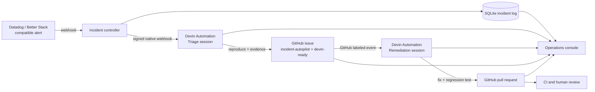

# Devin Superset Incident Autopilot

An event-driven incident response system for customer-facing analytics built
with Apache Superset Embedded SDK and Devin Cloud.

The demo starts with a production-style alert, asks one Devin to validate the
signal and write a reproducible GitHub issue, then lets a separate Devin fix the
issue, test the change, and open a pull request. A small operations console
shows the incident, both autonomous sessions, engineering artifacts, success
signals, and compute consumption. A human remains the merge and deployment
gate.

## Why this workflow

Embedded analytics failures are customer-facing, but their source may span the
host SaaS application, the Superset SDK, authentication, and the Superset
backend. The expensive part of an alert is the engineering loop after the
page: gathering evidence, reproducing the behavior, identifying ownership,
building a safe fix, and proving it with tests.

This project turns that loop into durable cloud infrastructure. Devin runs in a
shared, prebuilt repository environment, works while the team is offline, and
handles several incidents concurrently. GitHub issues and pull requests remain
the reviewable system of record.

## Live proof

- Incident: `INC-C4C51257`, a SEV-2 spike to 18.7% guest-token errors across
  1,264 embedded sessions
- Triage output: [Superset issue #1](https://github.com/engineerA314/superset/issues/1)
- Reproduction: 50 embedded clients retry in synchronized ten-second waves on
  the unmodified default branch
- Remediation: [Superset PR #2](https://github.com/engineerA314/superset/pull/2),
  dispatched automatically when triage applied `devin-ready`

## Architecture



There are deliberately two agents:

1. **Triage Devin** treats the monitor's explanation as a hypothesis. It
   inspects the current default branch, reproduces or falsifies the failure,
   and creates one evidence-backed issue. It is forbidden from changing code.
2. **Remediation Devin** starts from the GitHub `devin-ready` event. It
   independently reproduces the issue, implements the smallest fix, adds a
   regression test, runs relevant checks, opens a linked PR, and stops before
   merge.

This separation makes the issue a reviewable handoff contract and prevents an
alert from silently becoming an unverified code change.

## What the demo contains

- **Luma:** a mock SaaS analytics page using the real
  `@superset-ui/embedded-sdk`
- **Incident controller:** FastAPI, a persistent SQLite incident log, Devin API
  read model, native automation webhook dispatch, and GitHub artifact reads
- **Incident Workboard:** a multi-incident Alert → Issue → Pull Request →
  Resolved queue with search and operational filters. Every ticket opens a
  Devin-authored resolution report compiled from the triage issue and
  remediation PR, plus the linked sessions, metrics, and audit timeline
- **Automation as code:** idempotent scripts for two Devin Automations and a
  reusable Devin Cloud environment blueprint
- **Local Superset:** a script that builds and starts the fork with an embedded
  World Bank dashboard

## Quick start in preview mode

Preview mode renders the complete Luma product and Incident Resolution without
requiring Superset credentials.

```bash
cp .env.example .env
docker compose up --build
```

Open [Luma](http://localhost:3000) and choose **Incident Resolution**. The
controller health endpoint is [http://localhost:8000/health](http://localhost:8000/health).

Without Devin credentials, the resolution console remains read-only.

## Connect Devin Cloud

### Prerequisites

1. Connect the GitHub account that owns the Superset fork in Devin.
2. Give the Devin GitHub connection access to `engineerA314/superset` and enable
   the repository for Automations. Public forks require the Automation scope
   **All connected repos**.
3. Enable GitHub Issues on the fork.
4. Create a Devin service user/API key and copy the organization ID.

Set the following values in the ignored `.env` file:

```dotenv
DEVIN_API_KEY=cog_...
DEVIN_ORG_ID=...
GITHUB_REPOSITORY=engineerA314/superset
```

Provision the reusable cloud environment and both native Automations:

```bash
make provision-devin-environment
make provision-devin
```

`provision-devin` stores the generated webhook URL, one-time webhook secret,
and automation IDs in `.env` without printing secrets. Restart the controller
after provisioning:

```bash
docker compose up --build
```

`GITHUB_TOKEN` is optional. It only raises the operations console's GitHub read
limit or permits reading a private fork. Devin creates issues and PRs through
its native GitHub connection.

## Run the Apache Superset fork

Keep `engineerA314/devin-demo` and `engineerA314/superset` in sibling
directories, then run:

```bash
make superset
```

The command builds Superset from the fork, starts a disposable light stack,
loads the World Bank example, enables `EMBEDDED_SUPERSET`, and permits the local
Luma origins. It assigns the deterministic embedded dashboard UUID used by the
controller defaults.

The bootstrap includes a runtime-only compatibility copy for a broken World
Bank example path on current `master`. The forked source remains unchanged, so
the failure remains reproducible by an agent. The compose stack deliberately
uses no persistent Superset volumes.

Start Luma afterward:

```bash
docker compose up --build
```

- Superset: [http://localhost:9001](http://localhost:9001), local credentials
  `admin` / `admin`
- Luma: [http://localhost:3000](http://localhost:3000)

Set `SUPERSET_REPO=/absolute/path/to/superset` when the repositories are not
siblings.

## Trigger the workflow

Open **Run Simulation** and select **Dispatch incident**. The controller records
the incident and sends this Datadog-compatible alert shape to the native Devin
webhook. Progress then appears under **Incident Resolution**:

```json
{
  "event_type": "monitor.alert.triggered",
  "incident": {
    "id": "INC-...",
    "service": "superset-embedded",
    "severity": "SEV-2",
    "error_rate": 18.7,
    "p95_latency_ms": 4280,
    "affected_sessions": 1264
  },
  "monitor": {
    "name": "Embedded guest token refresh failure rate",
    "threshold": { "error_rate_percent": 5, "window_minutes": 5 }
  }
}
```

The workboard polls a joined read model every five seconds. It combines the
local incident log with Devin sessions and Automations plus GitHub issues and
pull requests. Tickets move across workflow stages as those durable artifacts
appear. Their detail pages compile semantic Markdown sections from Devin's
triage issue and remediation PR into a common resolution-report schema, so the
UI supports new incident types without scenario-specific evidence cards. The
observable completion contract is:

```text
alert persisted
  -> triage session dispatched
  -> reproducible issue created
  -> remediation session dispatched
  -> linked PR opened with passing focused tests
  -> human review
```

## Operations metrics

The console answers the questions an engineering leader needs during rollout:

| Signal | Meaning |
| --- | --- |
| Alert → validated issue | Time until the alert becomes a reproducible engineering contract |
| Alert → pull request | Time until a linked, reviewable remediation exists |
| Tests passed | Verification reported by the remediation PR and Devin session |
| Failed runs | Incident runs that require operational attention |
| Approval pending | Review-ready PRs waiting at the human production gate |
| Source health | Freshness and availability of Devin, GitHub, and Automations data |

The current proof run reached a validated issue in **3m 34s**, opened its PR in
**8m 26s**, and finished independent verification in **10m 15s**. Production
extensions would add human acceptance rate, rollback rate, and savings against
historical on-call handling time.

## Local development

Web application:

```bash
cd apps/web
npm install
npm run dev
```

Controller:

```bash
cd apps/controller
python -m venv .venv
source .venv/bin/activate
pip install -r requirements.txt
uvicorn app.main:app --reload --port 8000
```

Validation:

```bash
cd apps/web && npm run lint && npm run build
python -m compileall apps/controller/app scripts
docker compose config --quiet
```

## Safety and operating controls

- The alert payload is evidence, not a trusted root cause.
- Triage may create an issue only after deterministic reproduction.
- Remediation is triggered by the explicit `devin-ready` label.
- Sessions have per-run ACU limits, hourly invocation limits, concurrency caps,
  and queue depth limits.
- The remediation prompt prohibits merge. CI and a human reviewer remain the
  production gate.
- `.env` is ignored. Superset, GitHub, and Devin credentials never enter the
  browser bundle or Git history.

## Repository roles

- [`engineerA314/devin-demo`](https://github.com/engineerA314/devin-demo):
  product demo, incident controller, Devin integration, reporting, Docker
  runtime, and reproducible setup
- [`engineerA314/superset`](https://github.com/engineerA314/superset): forked
  application code, incident issues, and Devin-generated remediation PRs
