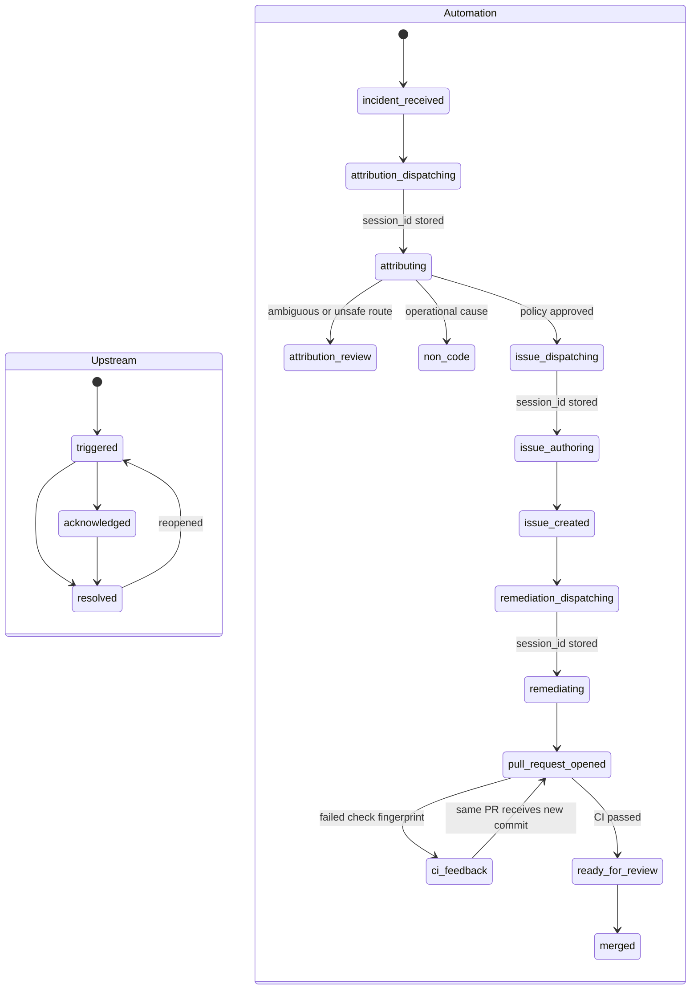

# Incident Autopilot control plane

## Scope

The control plane accepts two work sources across an allowlisted product and
Apache Superset repository pair:

1. a qualified observability incident lifecycle event at
   `POST /api/v1/incidents/events`; or
2. a GitHub issue carrying the `autopilot-managed` admission label.

Datadog, Better Stack, Grafana, or another upstream system remains responsible
for monitor evaluation, alert grouping, severity, and human paging. This service
owns the autonomous engineering response.

## Observability boundary

The incident controller does not store telemetry, evaluate monitors, or replace
the upstream observability product. Intake contains only the customer-visible
symptom and links to the provider's read-only views. In production, an
attribution session would use scoped provider API credentials to inspect those
views.

The public demo replaces that credentialed boundary with deterministic exports
under `apps/controller/fixtures/cd-1`: browser RUM, APM traces, a warehouse
query digest, chart configurations, service health, and deployment events. The
same snapshot is immutable and reproducible for every local run. It contains no
target repository, source path, root-cause label, or proposed fix. The agent
must correlate it with the service catalog and repository code.

## Identity model

Three IDs prevent alert noise from becoming duplicate paid work:

| Identity | Purpose |
| --- | --- |
| `event_id` | Deduplicate an at-least-once webhook delivery |
| `incident_id` | Fold trigger, update, acknowledgement, and recovery into one workflow |
| workflow run ID | Correlate Devin sessions, the GitHub issue, and the PR |

`incident_events` retains each unique lifecycle event and its delivery count.
`workflow_runs` owns one current response state per upstream incident.
`workflow_events` is the append-only audit trail. SQLite runs in WAL mode.

## State model

The upstream incident lifecycle and engineering lifecycle are independent:



A recovery event updates customer-impact status but does not cancel an already
started root-cause fix.

## System attribution and routing

Incident intake deliberately stores the repository as `unassigned`. A read-only
Devin session receives the symptom-only incident, linked observability views,
and a trusted service catalog describing the embedded product and Superset
ownership boundaries. Its structured result
contains disposition, confidence, primary component and repository, related
components, evidence, counter-evidence, suspected paths, and a structured
reproduction result with the executed command and outcome.

The controller permits issue authoring only when the disposition requires a code
change, an executable test or deterministic script reproduced the failure, the
repository is allowlisted, confidence meets the configured threshold, and at
least one evidence item exists. Source inspection alone cannot pass this gate.
Ambiguous, out-of-scope, unreproduced, or low-confidence results stop for human
review. Non-code causes close without creating repository noise. A separate issue
session receives the approved context packet and is restricted to the selected
repository.

## Effectively-once dispatch

`record_incident_event()` uses `BEGIN IMMEDIATE` to atomically deduplicate the
delivery and upsert the upstream incident. `claim_dispatch()` uses another
atomic transaction to give only one worker the right to call Devin.

Every session request includes a deterministic `workflow-<run-id>` tag. The
returned `session_id` is stored immediately. If the HTTP outcome is ambiguous,
the reconciler can find the created session by its tag before retrying. This
turns at-least-once event delivery into effectively-once paid agent work.

## Artifact correlation

Time proximity is never used as a join key:

- workflow → stored Devin `session_id`;
- session → `workflow-<run-id>` tag;
- issue → `<!-- devin-autopilot-run:<run-id> -->` marker;
- PR → the same marker and `Closes #<issue-number>`.

GitHub can push managed issue events to `/api/v1/webhooks/github`. The endpoint
requires `X-Hub-Signature-256` when configured. Periodic reconciliation repairs
lost webhooks and detects manually labeled issues.

## Bounded CI feedback

The reconciler reads check runs for each open managed PR. A failed verdict is
fingerprinted from the head SHA and failed check conclusions, then atomically
claimed before the controller sends it to the existing remediation session via
the Devin messages API. Devin fixes and pushes the same branch. The next head
SHA produces a fresh CI decision. The same fingerprint is delivered once, and
the workflow stops after two feedback attempts for human review.

## Trust and autonomy boundaries

Incident evidence, attribution output, and GitHub bodies are wrapped as untrusted
data in Devin prompts. Repository scope is enforced server-side. Attribution is
read-only, issue authoring cannot modify code, and remediation cannot merge.
Separate ACU limits bound the stages. CI and human review remain the production
gate.

## Verified invariants

The controller tests prove that:

- a duplicate `event_id` increments delivery count without creating a run;
- different events with one `incident_id` fold into one workflow;
- one incident triggers one Devin attribution session;
- only an executed, allowlisted, evidence-backed, high-confidence attribution can
  dispatch the issue session;
- the CD-1 snapshot exposes six independent evidence sources without embedding
  the Superset function name or cache-bypass diagnosis;
- eight concurrent dispatch claims have one winner; and
- concurrent incidents keep their sessions, issues, and PRs isolated;
- concurrent CI polls deliver one message for one failure fingerprint; and
- CI feedback stops at the configured retry bound.

```bash
PYTHONPATH=apps/controller .venv/bin/python -m unittest discover -s apps/controller/tests -v
```
