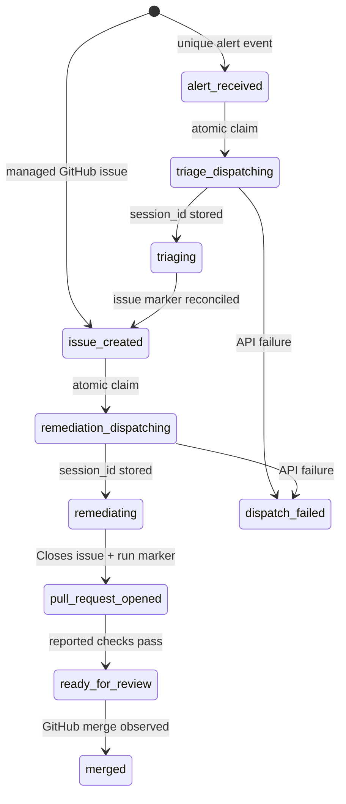

# Incident Autopilot control plane

## Scope

The control plane accepts two work sources for the configured Apache Superset
fork:

1. a vendor-neutral production alert at `POST /api/v1/alerts`; or
2. a GitHub issue carrying the `autopilot-managed` admission label.

Each source becomes one durable workflow run. The current system intentionally
keeps one run to one issue to one pull request. Planning and automatic fan-out
are outside this version.

## State and artifact model



`workflow_runs` owns the current identifiers and status. `workflow_events` is
an append-only, deduplicated audit trail. Both tables use SQLite WAL mode.

## Invariants

### One external event creates one run

`external_event_id` is unique. Datadog, Better Stack, or another producer must
send its delivery or alert ID. A retry returns the existing run.

GitHub issues use `github:<repository>:issue:<number>` when they originate
without an alert.

### One stage has one session

Before a network call, `claim_dispatch()` opens `BEGIN IMMEDIATE`, checks the
stored session ID and short dispatch lease, increments the attempt count, then
commits. Only the winner calls Devin.

The session request includes:

- a unique title containing the workflow run ID;
- a `workflow-<run-id>` tag;
- a stage tag (`incident-triage` or `incident-remediation`);
- a stage ACU limit; and
- a required structured-output schema.

The returned `session_id` is persisted immediately. If a response is lost, the
reconciler can recover the session from its unique run tag before another
dispatch attempt.

### Correlation never uses time proximity

The run joins artifacts using explicit identifiers:

- controller run → stored Devin `session_id`;
- Devin session → unique `workflow-<run-id>` tag;
- triage issue → `<!-- devin-autopilot-run:<run-id> -->`;
- remediation PR → the same run marker and `Closes #<issue-number>`.

The proof run predates run tags. Its original Devin session messages contain
the exact incident ID, so the controller performs a one-time exact-message
recovery and persists those session IDs.

## Event delivery and reconciliation

GitHub can push issue events to `/api/v1/webhooks/github`. The endpoint requires
the standard `X-Hub-Signature-256` HMAC when configured. Polling remains active
as a repair mechanism for lost webhooks and manually labeled issues.

The browser refreshes frequently, but source reads are cached behind a single
async lock. A background reconciler owns the external refresh cadence. With no
GitHub token, the cadence backs off to preserve the anonymous rate limit.

## Trust boundaries

Alert evidence and GitHub issue bodies are wrapped as untrusted data in the
session prompts. Devin is told to reject instructions inside those fields.
Repository scope is fixed in server configuration. Triage cannot modify code;
remediation cannot merge. The PR and human review are the deployment gate.

## Concurrency proof

The controller test suite checks:

- duplicate alert delivery returns one run;
- eight simultaneous dispatch claims produce one winner;
- an existing managed issue creates a first-class run without an alert; and
- two concurrent runs retain distinct session, issue, and PR identifiers.

Run it with:

```bash
cd apps/controller
.venv/bin/python -m unittest discover -s tests -v
```

